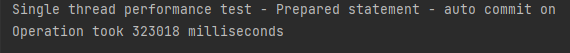
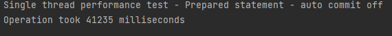
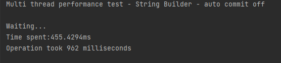

# Employee CSV Data Migration Project

## Table of Contents
* [General Info](#general-information)
* [Technologies Used](#technologies-used)
* [Features](#features)
* [Screenshots](#screenshots)
* [Test](#Tests)
* [Setup](#setup)
* [MySQL](#mysql-setup)
* [Performance upgrades](#Performance-upgrades)
* [Contact](#contact)


## General Information
- Application created as part of sparta global training
- App allow to migrate data form ```CSV``` file onto database (MySql)
- Command Line Interface

## Technologies Used

- [SOLID](https://en.wikipedia.org/wiki/SOLID)
- [OOP](https://en.wikipedia.org/wiki/Object-oriented_programming)
- [MVC](https://en.wikipedia.org/wiki/Model%E2%80%93view%E2%80%93controller)
- [MySQL](https://en.wikipedia.org/wiki/MySQL)
- [MAVEN](https://en.wikipedia.org/wiki/Apache_Maven)
- [GIT](https://en.wikipedia.org/wiki/Git)/[GITHUB](https://en.wikipedia.org/wiki/GitHub)
- [Design patterns](https://en.wikipedia.org/wiki/Software_design_pattern):
    - [Builder](https://en.wikipedia.org/wiki/Builder_pattern)
    - [Singleton](https://en.wikipedia.org/wiki/Singleton_pattern)
    - [DAO](https://en.wikipedia.org/wiki/Data_access_object)
    - [Decorator](https://en.wikipedia.org/wiki/Decorator_pattern)
- [Collections](https://docs.oracle.com/en/java/javase/18/docs/api/java.base/java/util/Collections.html)
- [jUnit](https://en.wikipedia.org/wiki/JUnit)
- [Log4j](https://en.wikipedia.org/wiki/Log4j)
- [JDBC](https://en.wikipedia.org/wiki/Java_Database_Connectivity)
- [Exceptions](https://docs.oracle.com/javase/7/docs/api/java/lang/Exception.html)
- [Scanner](https://docs.oracle.com/en/java/javase/18/docs/api/java.base/java/util/Scanner.html)
- [Multi-Threading](https://docs.oracle.com/en/java/javase/18/docs/api/java.base/java/lang/Thread.html)

## Features
1. Validation each records individually for potential errors.
2. Multi-threading support with option to chose number of threads to run.
3. Retrieving individual record from database by ID

## Screenshots


## Tests

**We tested individually each  validator to make sure they are fully operational**

```java
@Test
    @DisplayName("Join date after DoB")
    void testJoiningDateAfterDoB(){
        // DoB: 12/12/1974  Joining Date: 6/4/2011
        Employee employee = employeeParser.parse("1,Mr.,Tim,A,Duncan,M,timduncan@hotmail.com,12/12/1974,6/4/2011,26012");
        Assertions.assertEquals(true, dateValidator.isValid(employee));
    }

    @Test
    @DisplayName("Join date before DoB")
    void testJoiningDateBeforeDoB(){
        // DoB: 5/11/2019   Joining Date: 3/8/2005
        Employee employee = employeeParser.parse("2,Mr.,Jason,L,Kidd,M,jkidd6@gmail.com,5/11/2019,3/8/2005,489101");
        Assertions.assertEquals(false, dateValidator.isValid(employee));
    }
```
```java
 @Test
    @DisplayName("DoB before future")
    void testDoBBeforeFuture(){
        // DoB: 7/11/1999
        Employee employee = employeeParser.parse("1,Mr.,Nate,P,Archibald,M,narch123@hotmail.com,7/11/1999,1/1/2008,190123");
        Assertions.assertEquals(true, dobValidator.isValid(employee));
    }

    @Test
    @DisplayName("DoB in future")
    void testDoBInFuture(){
        // DoB: 10/12/2028
        Employee employee = employeeParser.parse("2,Mr.,Andrei,T,Kirilenko,M,andreiii99@gmail.com,10/12/2028,2/4/1995,401930");
        Assertions.assertEquals(false, dobValidator.isValid(employee));
    }
```
```java
@Test
    @DisplayName("Standard email")
    void testStandardEmail(){
        // Email: random123@hotmail.com
        Employee employee = employeeParser.parse("1,Mrs.,Jane,P,Giddey,F,random123@hotmail.com,2/15/2001,11/3/2021,350921");
        Assertions.assertEquals(true, emailValidator.isValid(employee));
    }

    @Test
    @DisplayName("Numerical email")
    void testNumericalEmail(){
        // Email: 12345
        Employee employee = employeeParser.parse("2,Mr.,John,A,Wall,M,12345,2/11/1998,2/16/2015,103912");
        Assertions.assertEquals(false, emailValidator.isValid(employee));
    }

```
```java
@Test
    @DisplayName("Male")
    void testMaleGender(){
        // Gender: M
        Employee employee = employeeParser.parse("1,Mr.,Mike,B,Victor,M,mikevic@gmail.com,7/12/1954,1/11/1978,346138");
        Assertions.assertEquals(true, genderValidator.isValid(employee));
    }

    @Test
    @DisplayName("Female")
    void testFemaleGender(){
        // Gender: F
        Employee employee = employeeParser.parse("2,Mrs.,Ronda,W,Jackson,F,rjackson77@hotmail.com,10/10/1982,4/1/2009,100123");
        Assertions.assertEquals(true, genderValidator.isValid(employee));
    }
```

## Setup
In order to use this application please clone repository onto your local machine
1. Use this [link](https://github.com/vladlogyin/database-sparta) (click on icon)<br>
2. Open your IntelliJ (or any other IDE of your preference )<br>
3. Create New > Project from version control<br>
   <br> 
4. Paste repo ([link](https://github.com/vladlogyin/database-sparta)) & select where project will be saved. Click clone on bottom.

5. Once project is opened, load Maven build (pop up in right-hand corner)
   
6. Create new file under path:
>src/main/resources/

and name file -> **database.properties**

6. Inside please update your database credentials (where XXX is your login & password )
```
db.url = jdbc:mysql://localhost:3306/employee
db.username = XXX
db.password = XXX 
```

8. Move to SQL Setup

## MySQL setup

1. This software requires MySQL & MySQL workbench(or any other tool of your preference )
2. Please make sure your MySql Server is running. (Task manager > Service ). If is not, right click on it > start

3. Create new schema (copy script)
```sql
CREATE schema employee;
```
3. Create new tables (copy script)
```sql
DROP TABLE IF exists employee;
CREATE table employee (
emp_number integer primary KEY,
name_preference varchar(5),
first_name varchar(20),
middle_name VARCHAR(1),
last_name varchar(20),
gender char,
email VARCHAR(40),
date_of_birth date,
joining_date date,
salary integer
);
```

## Performance upgrades

Our base case for checking performance was saving each employee in database using:
>[Prepared Statement](https://docs.oracle.com/en/java/javase/18/docs/api/java.sql/java/sql/PreparedStatement.html) with [auto-commit](https://docs.oracle.com/en/java/javase/18/docs/api/java.sql/java/sql/Connection.html#setAutoCommit(boolean)) - **true**

```java
public static void saveEmployee(Employee employee, PreparedStatement statement) {
        Connection conn = ConnectionFactory.getConnection();
        try {
            synchronized (statement) {
                statement.setInt(1, employee.getEmpNumber());
                statement.setString(2, String.valueOf((employee.getNamePreference())));
                statement.setString(3, employee.getFirstName());
                statement.setString(4, String.valueOf(employee.getMiddleName()));
                statement.setString(5, employee.getLastName());
                statement.setString(6, String.valueOf(employee.getGender()));
                statement.setString(7, employee.getEmail());
                statement.setDate(8, employee.getDateOfBirth());
                statement.setDate(9, employee.getJoiningDate());
                statement.setInt(10, employee.getSalary());
                statement.addBatch();
            }
        } catch (SQLException e) {
            Logger.error(e.getMessage());
        }
    }
```
```java
public static void saveFromCollection(Collection<Employee> employeeList, Boolean autoCommit) {
        try {
            ConnectionFactory.getConnection().setAutoCommit(autoCommit);
        } catch (SQLException e) {
            Logger.error(e.getMessage());
        }
        for (Employee emp : employeeList) {
            saveEmployee(emp);
        }
        try {
            ConnectionFactory.connection.commit();
        } catch (SQLException e) {
            Logger.error(e.getMessage());
        }
    }
```



Our next step was to set [auto-commit](https://docs.oracle.com/en/java/javase/18/docs/api/java.sql/java/sql/Connection.html#setAutoCommit(boolean)) to **false**.<br><br>


At this stage we discover that committing changes after whole batch is ready is more efficient than committing changes after each individual employee. <br>

Knowing all of that, we tested if multi-threading will increase performance even further

```java
public static void saveFromCollectionParallel(Collection<Employee> employeeList) {
        final int threadCount = 2;

        long startNano = System.nanoTime();
        final Connection conn = ConnectionFactory.getConnection();
        final PreparedStatement[] threadSpecificStatements = new PreparedStatement[threadCount];
        try {
            conn.setAutoCommit(false);
            for (int i = 0; i < threadCount; i++) {
                threadSpecificStatements[i] = conn.prepareStatement(INSERT_SQL_STATEMENT);
            }
        } catch (SQLException e) {
            Logger.error("Exception thrown during statement setup:\n" + e.toString());
        }

        ThreadPool.forEach(employeeList, (employee,threadID) -> {
            saveEmployee(employee,threadSpecificStatements[threadID]);
        }, threadCount);

        try {
            ThreadPool.forEach(Arrays.asList(threadSpecificStatements), (statement, threadID) -> {
                try {
                    statement.executeBatch();
                    statement.close();
                    conn.commit();

                }
                catch (SQLException e)
                {
                    Logger.error("Exception thrown in thread "+threadID+" during statement execution:\n" + e.toString());
                }
            }, threadCount);

        }
        catch (RuntimeException e)
        {
            Logger.error("Exception thrown during statement execution:\n" + e.toString());
        }

        long nanoDiff = System.nanoTime()-startNano;
        double milliSeconds = nanoDiff/1E6;
        System.out.println("Threads: " + threadCount + " time spent:" + milliSeconds+"ms");
    }
```


**At this stage we reduce inserting time from 3.5 minutes down to around 14 sek.**

>*Our next goal was try to go down below 10 sek for whole operation.*

We slightly changed our approach to this. We decided to test if building SQL statement would be more efficient if we use [StringBuilder](https://docs.oracle.com/en/java/javase/18/docs/api/java.base/java/lang/StringBuilder.html).

```java
public static void saveFromCollectionParallelSuperFast(Collection<Employee> employeeList)
    {
        final int threadCount=2;

        long startNano = System.nanoTime();
        Connection conn = ConnectionFactory.getConnection();
        final PreparedStatement[] threadSpecificStatements = new PreparedStatement[threadCount];
        try {
            conn.setAutoCommit(false);
            for (int i = 0; i < threadCount; i++) {
                threadSpecificStatements[i] = conn.prepareStatement(INSERT_SQL_STATEMENT);
            }
        } catch (SQLException e) {
            Logger.error("Exception thrown during statement setup:\n" + e.toString());
        }
        StringBuilder query = new StringBuilder(10_000_000);
        query.append("INSERT INTO employee (emp_number,name_preference,first_name,middle_name,last_name,gender,email,date_of_birth,joining_date,salary) VALUES ");
        boolean first=true;
        for(Employee emp : employeeList)
        {
            if(first)
            {
                first=false;

            }
            else
            {
                query.append(',');
            }
            query.append('(');
            query.append(emp.getEmpNumber());
            query.append(",'");
            query.append(emp.getNamePreference());
            query.append("','");
            query.append(emp.getFirstName());
            query.append("','");
            query.append(emp.getMiddleName());
            query.append("','");
            query.append(emp.getLastName());
            query.append("','");
            query.append(emp.getGender());
            query.append("','");
            query.append(emp.getEmail());
            query.append("','");
            query.append(emp.getDateOfBirth().toString());
            query.append("','");
            query.append(emp.getJoiningDate().toString());
            query.append("',");
            query.append(emp.getSalary());
            query.append(")");

        }
        query.append(";");
        try {
            Statement s= conn.createStatement();
            s.execute(query.toString());
            conn.commit();
        } catch (SQLException e) {
            throw new RuntimeException(e);
        }

        long nanoDiff = System.nanoTime()-startNano;
        double milliSeconds = nanoDiff/1E6;
        System.out.println("Time spent:" + milliSeconds+"ms");
    }
```
<br>


Last test we performed was to check SB approaches with multi-threading




**All the test performed were based on:**
- same PC.
- identical data sets (CSV file).
- database tables were truncated before each test.


## Contact

Software created by : 

- [Mustafa Nawaz](	https://github.com/Typist01)
- [Bart Perczynski](https://github.com/Baaartosz)
- [Vlad Logyin](https://github.com/vladlogyin)
- [Omar Tehami](https://github.com/OTDZ)
- [Piotr(Peter) Wiatr](https://github.com/wiater88)


